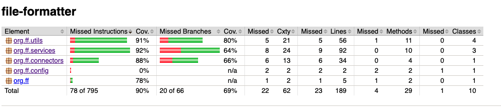

# File formatter




## Instructions

Clone the repo:

```
$ git clone git@github.com:open-source-utils/file-formatter.git
```

Or download a ZIP of main [manually](https://github.com/open-source-utils/file-formatter/archive/refs/heads/master.zip) and expand the contents someplace on your system

## Prerequisites

* Have a JDK installed
* Have Maven installed and available on your PATH or IDE

## Verify installation

You can verify the project builds correctly from your IDE or from the command
line.

### CLI

Open a command prompt and verify that all needed bins are on your path and up to date:

```
$ java -version
# ^ should be at least 18.0.1
$ mvn -v
# ^ should be at least 3.8.1
```

Finally, verify that `mvn install` succeeds.


### IntelliJ IDEA

1. Open IntelliJ IDEA and select _File > Open..._.
2. Choose the file-formatter directory and click _OK_.
3. Select _File > Project Structure..._ and ensure that the Project SDK and language level are set to use Java 18.
4. Open the Maven view with _View > Tool Windows > Maven_.
5. In the Maven view, click on _Execute Maven Goal_ run the `mvn install` goal to build the app.

## To generate code coverage

    mvn test

## To build App

    mvn clean compile package

## To run App
#### Note: Pipe should be passed as '|'
    java -cp target/file-formatter-jar-with-dependencies.jar org.ff.Application -path "<path to input files>" -names file1.extention file2.extention -delimiters <delimiter for file 1> <delimiter for file 2>   

## To see output
    <path to input files>/output/
        file1.extention_currentTimestamp.jsonl
        file1.extention_currentTimestamp.jsonl


## Quick guide
    cd to <path-to-file-formatter>
    mvn clean install
    java -cp target/file-formatter-jar-with-dependencies.jar org.ff.Application -path "data/" -names DSV-input-1.txt DSV-input-2.txt -delimiters , '|'
    <path-to-file-formatter>/data/output/
             
